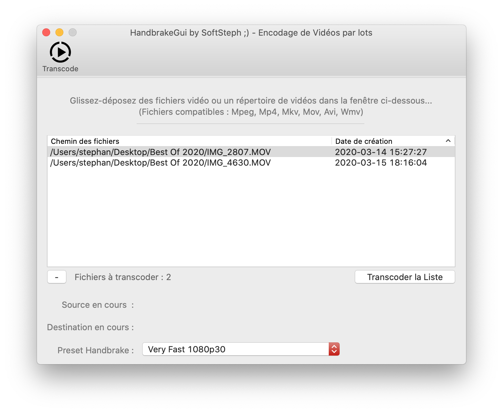

# Xojo-HandbrakeGui by SoftSteph ;)
Gui made with Xojo for HandbrakeCLI (Command Line) // XOJO 2017 + requis

Attention : pour utiliser ce logiciel, il vous faut télécharger HandbrakeCLI et l'insérer dans le répertoire "Ressources"

Fonctionnalités :
- Transcodage de Vidéos
- Import par glisser déposer de répertoires ou de fichiers
- Possibilité de choisir des Presets avec des tailles et indices de vitesse différents
- Compatible MacOs et Windows
- Gestion des formats acceptables par Handbrake lors de l'importation
- Barres de progression pour les tâches courantes et globales d'encodage

Todo List :
Téléchargement automatique de l'encodeur

Historique des versions :

V0.22 du 19/03/2020
Creation des videos converties dans le dossier "Reduced"
Correction d'un bug MacOs lie au NativePath vs ShellPath

V0.21 du 18/03/2020
Changement de la méthode FileDrop : permet la depose de dossiers sous Windows

V0.20 du 18/03/2020
Changement d'icone pour l'application HandbrakeGui

v.019 du 11/03/2020
Correction de Bugs sur ListIndex
Correction chemin d'accËs ‡ Handbrake sous Windows

v.018 du 07/03/2020
Adaptation SheetWindows pour Windows (pour se rapprocher de la version MacOs)

v.017 du 12/01/2020
Intégration Methode TopMost pour Windows (Premier Plan)

v.016 du 10/01/2020
Correction de bugs divers
Vérifications sous Windows

v.015 du 10/01/2020
Barre de progression de la conversion courante

v.014 du 10/01/2020
Corrections diverses de bug

v.013 du 09/01/2020
Barre de progression

v.012 du 09/01/2020
Gestion des formats acceptables par Handbrake
Sélection multiple et suppression multiple

v.011 du 09/01/2020
Compatible MacOs avec HandbrakeCli pour unix

v.010 du 09/01/2020
Compatible Windows avec HandbrakeCli.exe
Correction de bugs divers

v.09 du 08/01/2020
Premiere version Publique MacOs

v.08 du 08/01/2020
Possibilite de supprimer un fichier de la liste

v.07 du 08/01/2020
Fenetre de Log et Debuggage

v.06 du 08/01/2020
Integration des Presets Handbrake
